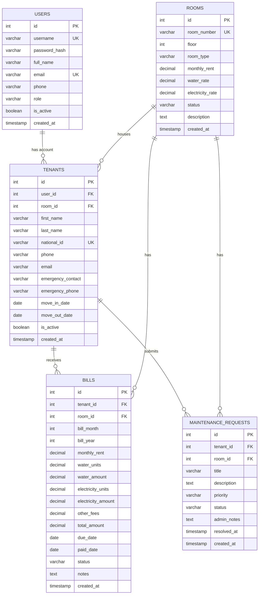

# 🗄 Database Schema & ER Diagram

## Entity Relationship Diagram

## Tables Description

### users
| Column | Type | Constraints | Description |
|--------|------|-------------|-------------|
| id | SERIAL | PK | Auto-increment |
| username | VARCHAR(50) | UNIQUE NOT NULL | ชื่อผู้ใช้ |
| password_hash | VARCHAR(255) | NOT NULL | bcrypt hash |
| full_name | VARCHAR(100) | NOT NULL | ชื่อเต็ม |
| email | VARCHAR(100) | UNIQUE NOT NULL | อีเมล |
| phone | VARCHAR(20) | | เบอร์โทร |
| role | VARCHAR(10) | CHECK (admin/tenant) | บทบาท |
| is_active | BOOLEAN | DEFAULT TRUE | สถานะใช้งาน |

### rooms
| Column | Type | Constraints | Description |
|--------|------|-------------|-------------|
| id | SERIAL | PK | Auto-increment |
| room_number | VARCHAR(20) | UNIQUE NOT NULL | หมายเลขห้อง |
| floor | INTEGER | NOT NULL | ชั้น |
| room_type | VARCHAR(50) | DEFAULT 'standard' | ประเภทห้อง |
| monthly_rent | DECIMAL(10,2) | NOT NULL | ค่าเช่า/เดือน |
| water_rate | DECIMAL(10,2) | DEFAULT 18.00 | ค่าน้ำ/หน่วย |
| electricity_rate | DECIMAL(10,2) | DEFAULT 8.00 | ค่าไฟ/หน่วย |
| status | VARCHAR(20) | CHECK (available/occupied/maintenance) | สถานะ |

### tenants
| Column | Type | Constraints | Description |
|--------|------|-------------|-------------|
| id | SERIAL | PK | Auto-increment |
| user_id | INTEGER | FK→users | บัญชีผู้ใช้ (optional) |
| room_id | INTEGER | FK→rooms | ห้องพัก |
| first_name | VARCHAR(50) | NOT NULL | ชื่อจริง |
| last_name | VARCHAR(50) | NOT NULL | นามสกุล |
| national_id | VARCHAR(13) | UNIQUE NOT NULL | เลขบัตรประชาชน |
| phone | VARCHAR(20) | NOT NULL | เบอร์โทรศัพท์ |
| email | VARCHAR(100) | | อีเมล |
| emergency_contact| VARCHAR(100) | | ผู้ติดต่อฉุกเฉิน |
| emergency_phone | VARCHAR(20) | | เบอร์ติดต่อฉุกเฉิน |
| move_in_date | DATE | NOT NULL | วันเข้าพัก |
| move_out_date | DATE | | วันย้ายออก |
| is_active | BOOLEAN | DEFAULT TRUE | ยังพักอยู่ |

### bills
| Column | Type | Constraints | Description |
|--------|------|-------------|-------------|
| id | SERIAL | PK | Auto-increment |
| tenant_id | INTEGER | FK→tenants | ผู้เช่า |
| room_id | INTEGER | FK→rooms | ห้องพัก |
| bill_month | INTEGER | CHECK (1-12) | เดือน |
| bill_year | INTEGER | | ปี |
| monthly_rent | DECIMAL(10,2) | NOT NULL | ค่าเช่ารายเดือน |
| water_units | DECIMAL(10,2) | DEFAULT 0 | หน่วยน้ำ |
| water_amount | DECIMAL(10,2) | DEFAULT 0 | ค่าน้ำรวม |
| electricity_units| DECIMAL(10,2) | DEFAULT 0 | หน่วยไฟ |
| electricity_amount| DECIMAL(10,2) | DEFAULT 0 | ค่าไฟรวม |
| other_fees | DECIMAL(10,2) | DEFAULT 0 | ค่าใช้จ่ายอื่นๆ |
| total_amount | DECIMAL(10,2) | NOT NULL | ยอดรวม |
| due_date | DATE | NOT NULL | วันครบกำหนดชำระ |
| paid_date | DATE | | วันที่ชำระเงิน |
| status | VARCHAR(20) | CHECK (pending/paid/overdue) | สถานะ |

### maintenance_requests
| Column | Type | Constraints | Description |
|--------|------|-------------|-------------|
| id | SERIAL | PK | Auto-increment |
| tenant_id | INTEGER | FK→tenants | ผู้เช่า |
| room_id | INTEGER | FK→rooms | ห้องพัก |
| title | VARCHAR(200) | NOT NULL | หัวข้อการแจ้งซ่อม |
| description | TEXT | NOT NULL | รายละเอียด |
| priority | VARCHAR(10) | CHECK (low/medium/high/urgent) | ความเร่งด่วน |
| status | VARCHAR(20) | CHECK (pending/in_progress/resolved/cancelled)| สถานะ |
| admin_notes | TEXT | | บันทึกจากผู้ดูแล |
| resolved_at | TIMESTAMP | | เวลาที่แก้ไขเสร็จ |
