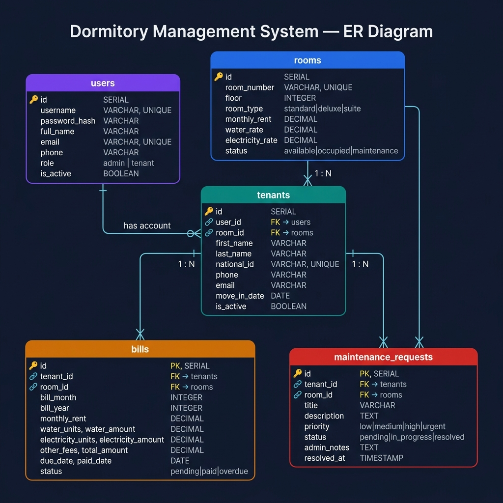

# 🏢 Dormitory Management System

ระบบจัดการหอพักแบบ Full Stack พัฒนาด้วย React + Node.js + PostgreSQL พร้อม Docker สำหรับการ Deploy

---

## 📋 สารบัญ

- [ความต้องการของระบบ](#ความต้องการของระบบ)
- [การติดตั้งและรันด้วย Docker](#การติดตั้งและรันด้วย-docker-แนะนำ)
- [การรันในโหมด Development](#การรันในโหมด-development)
- [บัญชีผู้ใช้สำหรับทดสอบ](#บัญชีผู้ใช้สำหรับทดสอบ)
- [โครงสร้างโปรเจกต์](#โครงสร้างโปรเจกต์)
- [ฐานข้อมูล](#ฐานข้อมูล)
- [API Documentation](#api-documentation)

---

## ⚙️ ความต้องการของระบบ

| เครื่องมือ | เวอร์ชันขั้นต่ำ |
|-----------|---------------|
| [Docker Desktop](https://www.docker.com/products/docker-desktop/) | 24+ |
| [Docker Compose](https://docs.docker.com/compose/) | 2.0+ (มาพร้อม Docker Desktop) |
| Node.js *(สำหรับ dev mode เท่านั้น)* | 18+ |

---

## 🐳 การติดตั้งและรันด้วย Docker (แนะนำ)

### ขั้นตอนที่ 1 — Clone โปรเจกต์

```bash
git clone https://github.com/PotatoCoputer/DormitoryMS.git
cd DormitoryMS
```

### ขั้นตอนที่ 2 — เปิด Docker Desktop

เปิดโปรแกรม **Docker Desktop** และรอจนกว่าสถานะจะเป็น **"Engine running"** (ไอคอนสีเขียวที่ Taskbar)

### ขั้นตอนที่ 3 — Build และรันระบบ

```bash
docker-compose up --build -d
```

> ครั้งแรกใช้เวลาประมาณ **2-5 นาที** เพื่อ Download image และ Build  
> ครั้งถัดไปจะเร็วขึ้นมากเพราะมี cache

### ขั้นตอนที่ 4 — เข้าใช้งาน

เปิดเบราว์เซอร์ไปที่: **[http://localhost](http://localhost)**

---

## 💻 การรันในโหมด Development

ใช้สำหรับพัฒนา/ทดสอบโค้ดโดยไม่ต้อง Rebuild Docker ทุกครั้ง

> ⚠️ ต้องหยุด Docker ก่อน (`docker-compose down`) เพื่อไม่ให้ port ชน

### 1. รัน Database (ยังคงใช้ Docker)

```bash
docker-compose up postgres -d
```

### 2. สร้างไฟล์ `.env` สำหรับ Server

สร้างไฟล์ `server/.env`:

```env
DB_HOST=localhost
DB_PORT=5432
DB_NAME=dormitory_ms
DB_USER=postgres
DB_PASSWORD=1234
JWT_SECRET=your-super-secret-key-change-in-production
JWT_EXPIRES_IN=7d
PORT=5000
```

### 3. รัน Backend

```bash
cd server
npm install
npm run dev
```

Backend จะรันที่ **http://localhost:5000**

### 4. รัน Frontend

```bash
cd client
npm install
npm run dev
```

Frontend จะรันที่ **http://localhost:5173**

---

## 👤 บัญชีผู้ใช้สำหรับทดสอบ

| Role | Username | Password | สิทธิ์ |
|------|----------|----------|--------|
| Admin | `admin` | `admin123` | จัดการทุกอย่างในระบบ |
| ผู้เช่า | `tenant1` | `tenant123` | ดูข้อมูลห้อง บิล และแจ้งซ่อม |
| ผู้เช่า | `tenant2` | `tenant123` | ดูข้อมูลห้อง บิล และแจ้งซ่อม |
| ผู้เช่า | `tenant3` | `tenant123` | ดูข้อมูลห้อง บิล และแจ้งซ่อม |

---

## 📁 โครงสร้างโปรเจกต์

```
DormitoryMS/
├── client/                     # React Frontend (Vite)
│   ├── src/
│   │   ├── components/         # Shared Components (Layout, etc.)
│   │   ├── context/            # Auth Context
│   │   ├── pages/              # หน้าต่างๆ
│   │   │   ├── LoginPage.jsx
│   │   │   ├── DashboardPage.jsx
│   │   │   ├── RoomsPage.jsx
│   │   │   ├── TenantsPage.jsx
│   │   │   ├── BillsPage.jsx
│   │   │   ├── MaintenancePage.jsx
│   │   │   ├── MyRoomPage.jsx  # สำหรับ Tenant
│   │   │   └── MyBillsPage.jsx # สำหรับ Tenant
│   │   └── services/           # API Service (axios)
│   ├── Dockerfile
│   └── nginx.conf
│
├── server/                     # Node.js Backend (Express)
│   ├── src/
│   │   ├── config/             # DB Connection
│   │   ├── middleware/         # Auth Middleware
│   │   ├── routes/             # API Routes
│   │   │   ├── auth.js
│   │   │   ├── rooms.js
│   │   │   ├── tenants.js
│   │   │   ├── bills.js
│   │   │   ├── maintenance.js
│   │   │   └── dashboard.js
│   │   ├── database/
│   │   │   └── schema.sql      # DB Schema + Seed Data
│   │   └── index.js            # Entry Point
│   └── Dockerfile
│
└── docker-compose.yml          # Orchestration
```

---

## 🗄️ ฐานข้อมูล

### Entity-Relationship Diagram




### การ Reset ฐานข้อมูล


```bash
# ล้างข้อมูลทั้งหมดและเริ่มใหม่ (จะ Auto-Seed ข้อมูลตัวอย่างให้)
docker-compose down -v
docker-compose up -d
```

---

## 📡 API Documentation

ดูรายละเอียด API ทั้งหมดได้ที่ **[API_DOCS.md](./API_DOCS.md)**

หรือเปิด Swagger UI ได้ที่ **[http://localhost:5000/api-docs](http://localhost:5000/api-docs)** (ขณะที่ระบบรันอยู่)

### API Endpoints สรุป

| Method | Endpoint | Auth | คำอธิบาย |
|--------|----------|------|---------|
| POST | `/api/auth/login` | ❌ | เข้าสู่ระบบ |
| GET | `/api/rooms` | ✅ | ดูรายการห้อง |
| GET | `/api/tenants` | Admin | ดูรายการผู้เช่า |
| GET | `/api/bills` | ✅ | ดูรายการบิล |
| GET | `/api/maintenance` | ✅ | ดูรายการแจ้งซ่อม |
| GET | `/api/dashboard` | Admin | ดูสรุปภาพรวม |
| GET | `/api/health` | ❌ | ตรวจสอบสถานะ API |

